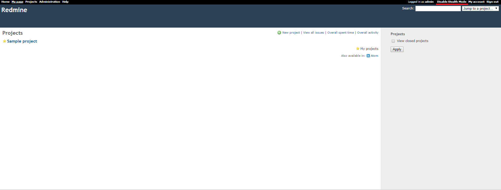

# Redmine Stealth Plugin

This plugin allows Users to temporarily disable sending email messages when the Redmine content is added or changed, for example, when updating issues or wiki pages. The plugin is intended to allow Users to make bulk changes or minor corrections without flooding the inboxes of other users.

A permission has to be enabled in the roles to use this feature.

The initial author of the plugin is [Riley Lynch](https://github.com/teleological/redmine_stealth).

## Copmatibility

This plugin si compatible with Redmine 5.x and later. Detailed information here: [travis](https://travis-ci.org/Restream/redmine_stealth)

## Installation

*These installation instructions are based on Redmine 2.6.0. For instructions for previous versions, see [Redmine wiki](http://www.redmine.org/projects/redmine/wiki/Plugins).*

1. To install the plugin
    * Download the .ZIP archive, extract files and copy the plugin directory into *#{REDMINE_ROOT}/plugins*.

    Or

    * Change you current directory to your Redmine root directory:

            cd {REDMINE_ROOT}

      Copy the plugin from GitHub using the following command:

            git clone https://github.com/Restream/redmine_stealth.git plugins/redmine_stealth

2. Update the Gemfile.lock file by running the following commands:

         bundle install

3. This plugin requires a migration. Run the following command to upgrade your database (make a database backup before):

        bundle exec rake redmine:plugins:migrate RAILS_ENV=production

4. Restart Redmine.

Now you should be able to see the plugin in **Administration > Plugins**.

## Usage

To activate the stealth mode feature, click **My account** and then select the **Allow toggling stealth mode** check box in the **Redmine Stealth** section.

This will add the **Enable Stealth Mode** / **Disable Stealth Mode** link to the right top menu, next to **My account**.

To enable the stealth mode and prevent Redmine from sending email messages, click **Enable Stealth Mode**.

Redmine will not send email notifications about your actions while the stealth mode is enabled. However, it will continue to send email messages about other users' actions.

After you finish, click **Disable Stealth Mode** to return to normal mode.

Other Redmine users can also enable or disable the stealth mode by clicking the **Enable Stealth Mode** / **Disable Stealth Mode** link, if they have the corresponding permissions.

## Changelog

V0.7.5 hide toggle sidebar icon if responsive design is enabled

## Maintainers

Danil Tashkinov, [github.com/nodecarter](https://github.com/nodecarter)

## License

This software is licensed under the GNU GPL v2. See COPYRIGHT and COPYING for details.

<kbd> <!-- .element height="10%" width="10%" --></kbd>
